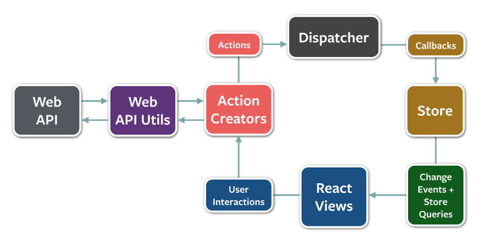

# 🤙 TamoTam. HangOut. Offline.

## Go Online to be Offline.

### ~~ Please Read ~~

The application is in an early stage of development, the so-called "Early Alpha".
It's relatively stable, but some features might not work, and we kindly ask you not to review it poorly for that reason. We release it to get feedback if there's a need for such an application.

List of known issues:
- Long loading time during initial load, especially for non-US based users,
- Uploaded Images aren't displayed after reloading the application,
- Sometimes, users-added (white Markers) aren't loaded,
- Edited events aren't reflected on the Map,
- Not an issue, but we might need to be more explicit about it: date & time are aligned per your localization.

The remaining list of improvements can be found on https://github.com/tamotam-com/tamotam-app/issues.
That's an Open Source project; feel free to contribute.

### ~~ Normal Description ~~
TamoTam aims to limit online time spent on applications. In our Proof of Concept (PoC), we showcase a list of offline events happening around and allow users to add them by themselves without any registration.

Eventually, we want to keep the user as little time as possible in TamoTam in favor of spending time outside the screen.
The application aims to be minimalistic and exclude features such as:
- Feed, which addicts users to stay outside the real world,
- Likes, we advise you to watch The Social Dilemma to understand why,
- Comments, #StopHate,
- Share, #StopFakeNews,
- Other complicated Algorithms unconsciously affect you to stay online.

That's because we believe Social Media affects us mentally, such as Anxiety, Depression, Fear Of Missing Out (FOMO), Fear of Speaking Up, Isolation, and more.

It will take time before the application will be performant and user-friendly, but in early 2023 we expect Late Alpha / Early Beta.
Thanks in advance for understanding while reviewing TamoTam.

Look what's happening around you in a Real. Offline. Social Life.

## Launch

### Android Simulator

1. Run on `Android Studio`
2. `yarn start`
3. `adb reverse tcp:8081 tcp:8081`

Alternatively, `expo run:android --variant release`, for production version.

#### Kill Android Simulator

`adb -s emulator-5554 emu kill`, where `emulator-5554` is the emulator name.

### iOS Simulator

1. Build using `Xcode`, if the application isn't installed on the simulator
2. `yarn start`
3. `i`

Alternatively, `expo run:ios --configuration Release`, for production version.

## Release

1. `eas build -p android`
2. `eas build -p ios`

## Architecture

We're using `Redux`, but the easiest to understand the architecture is the image below with `Flux` architecture, which in fact is really similar. However, it's important to note we're using 1 store, like in `Redux` architecture.

*Image source: https://www.freecodecamp.org/news/an-introduction-to-the-flux-architectural-pattern-674ea74775c9/*

## Contact

contact[at]tamotam[dot]com
