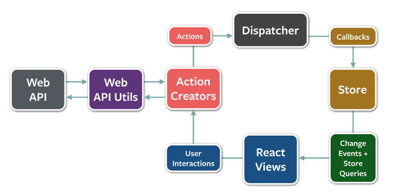
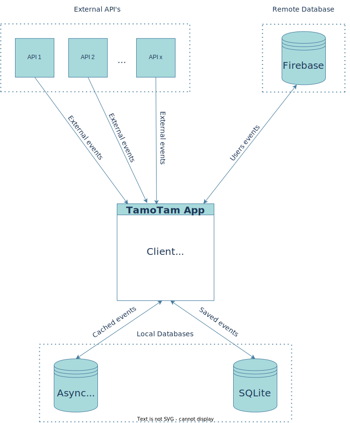

# 🤙 TamoTam. HangOut. Offline.

## Description

List of offline events happening around you. No login or registration required.

### Go Online to be Offline.

TamoTam aims to limit online time spent on digital applications in favour of offline social life, outside of the screen.

The application aims to be minimalistic and exclude features such as:

- Addictive Feed,
- Destructive Notifications,
- Brain-affecting Likes,
- Comments, #StopHate,
- Share, #StopFakeNews,
- Other complicated Algorithms unconsciously affect you to stay online.

That's because we believe Social Media affects us mentally, such as Anxiety, Depression, Fear Of Missing Out (FOMO), Fear of Speaking Up, Isolation, and more.

Look what's happening around you in a Real. Offline. Social Life.
Contribute to that idea by adding your events (login or registration required).

### Note

The application is in an early stage of development with a number of [improvements & issues](https://github.com/tamotam-com/tamotam-app/issues).
It will take time before the application will be complete, performant and user-friendly, but in late 2023 we expect Early Beta.

Thanks in advance for understanding while reviewing TamoTam.

## Developers

That's an Open Source project; feel free to contribute.

### Frontend/JavaScript/Web Developer interested in React Native/JavaScript Mobile Development?

The project is a combination of a personal education project to learn JavaScript Mobile Development using `React Native` and business idea to create a mobile app with offline-only events to limit online time.

Therefore, even if that's just from business point of view super easy app for now, it contains several nice technical implementation, which helped me to understand the ecosystem on `React Native` and become better developer.

### Technological stack

- `React/Native` + `TypeScript`;
- `Redux`;
- Different databases (`Firebase`, `SQLite`, `AsyncStorage`);
- `AsyncStorage`, which is really comparable to `localStorage` we have on Web;
- Caching data using `AsyncStorage`;
- Making the Web code actually compiled & working with deployed app to the store;
- Logging & Monitoring to `Firebase Analytics`/`Firebase Performance Monitoring`;
- Reporting crashes to `Firebase Crashlytics`;
- Handling environmental variables in `Android`, `iOS`, and `Web` - changes in native code were required;
- Integration of 3rd party tools, like `Firebase`-* and `Google Maps`;
- Usage, looks & feel of `Material Design` (`React Native Paper`) in a real application.

### Stay up to date

Keep yourself up to date about TamoTam and me motivated by giving a **Star** :-)

## Run it

### Android Simulator

1. Run on `Android Studio`
2. `yarn start`
3. `adb reverse tcp:8081 tcp:8081`

Alternatively, `expo run:android --variant release`, for production version.

#### Kill Android Simulator

`adb -s emulator-5554 emu kill`, where `emulator-5554` is the emulator name.

### iOS Simulator

1. Build using `Xcode`, if the application isn't installed on the simulator
2. `yarn start`
3. `i`

Alternatively, `expo run:ios --configuration Release`, for production version.

### Release

1. `eas build -p android`
2. `eas build -p ios`

## Architecture

We're using `Redux`, but the easiest to understand the architecture is the image below with `Flux` architecture, which in fact is really similar. However, it's important to note we're using 1 store, like in `Redux` architecture.

*Image source: https://www.freecodecamp.org/news/an-introduction-to-the-flux-architectural-pattern-674ea74775c9/*

External API's, like `Ticketmaster`, provide +/- 10k of external events. The `TamoTam`'s client is fetching also events added by the user, from `Firebase`. After all events will be fetched, those are being cached locally, using [AsyncStorage](https://github.com/react-native-async-storage/async-storage). After events are being cached locally on a device, the user can save their favourite events. Those saved events are also saved locally on a device. Those are saved using `SQLite`. In addition to that, users can add their own events, and those are saved in `Firebase`.

*Made using: https://app.diagrams.net*

## In media

- [Codrops Newsletter](https://tympanus.net/codrops/collective/collective-736/)
- [React Status Newsletter](https://react.statuscode.com/issues/310)
- [Reddit r/reactnative](https://www.reddit.com/r/reactnative/comments/xzcxn8/react_native_typescript_app_with_firebase/)

## Contact

contact[at]tamotam[dot]com
